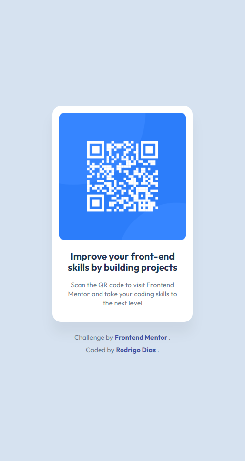

# Frontend Mentor - QR Code Component Solution



Esta é a minha solução para o desafio do componente de QR Code do [Frontend Mentor](https://www.frontendmentor.io?utm_source=chatgpt.com).  
O projeto foi desenvolvido com foco em:

- HTML5 semântico
- CSS organizado com variáveis
- Responsividade
- Estrutura profissional
- Fidelidade visual ao design original

---

# 📋 Sumário

- [🔍 Visão Geral](#-visão-geral)
  - [O desafio](#o-desafio)
  - [Screenshot](#screenshot)
  - [Links](#links)
- [🛠️ Meu processo](#️-meu-processo)
  - [Tecnologias utilizadas](#tecnologias-utilizadas)
  - [O que eu aprendi](#o-que-eu-aprendi)
  - [Recursos úteis](#recursos-úteis)
- [👤 Autor](#-autor)

---

# 🔍 Visão Geral

## O desafio

Os usuários devem ser capazes de:

- Visualizar o layout ideal para o componente dependendo do tamanho da tela do dispositivo.
- Navegar corretamente em dispositivos mobile e desktop.
- Ter uma experiência visual fiel ao design proposto.

### Layouts trabalhados

- Mobile: `375px`
- Desktop: `1440px`

---

# 🔗 Links

## URL da Solução

[Repositório no GitHub](https://github.com/rodrigo-dias-dev/frontendmentor-qr-code-component?utm_source=chatgpt.com)

## URL do Site

[GitHub Pages - QR Code Component](https://rodrigo-dias-dev.github.io/frontendmentor-qr-code-component/?utm_source=chatgpt.com)

---

# 🛠️ Meu processo

## Tecnologias utilizadas

- HTML5 (Foco em semântica)
- CSS3
  - Variáveis CSS
  - Flexbox
  - Grid
- Metodologia Mobile-First
- Google Fonts (Outfit)

---

# 📚 O que eu aprendi

Neste projeto, pude aprimorar:

- Estruturação semântica com HTML5
- Organização profissional de CSS
- Uso de Design Tokens com variáveis CSS
- Centralização absoluta utilizando CSS Grid
- Refinamento visual para atingir um resultado pixel-perfect
- Controle de densidade tipográfica para diferentes idiomas

Exemplo utilizado no projeto:

```css
:root {
  --fs-title: 1.25rem;
  --shadow-card: 0px 25px 25px rgba(0, 0, 0, 0.05);
}
```

---

# 📖 Recursos úteis

- [MDN Web Docs](https://developer.mozilla.org/pt-BR/?utm_source=chatgpt.com)  
  Principal fonte de consulta para HTML semântico e CSS.

- [Curso em Vídeo](https://www.cursoemvideo.com/?utm_source=chatgpt.com)  
  Base fundamental para o aprendizado de HTML5 e CSS3.

- [Frontend Mentor](https://www.frontendmentor.io?utm_source=chatgpt.com)  
  Plataforma utilizada para praticar desafios reais de Front-End.

---

# 👤 Autor

## Rodrigo Dias

- [Frontend Mentor - @rodrigo-dias-dev](https://www.frontendmentor.io/profile/rodrigo-dias-dev?utm_source=chatgpt.com)

- [GitHub - rodrigo-dias-dev](https://github.com/rodrigo-dias-dev?utm_source=chatgpt.com)